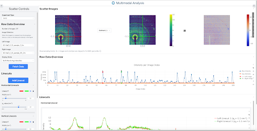

# React GUI Scattering

A web-based tool for SAXS and GISAXS scattering data visualization and analysis.



## Overview

This application provides an interactive interface for scientists to analyze small-angle X-ray scattering (SAXS) and grazing-incidence small-angle X-ray scattering (GISAXS) data. It enables users to explore, visualize, and extract meaningful patterns from scattering data through various analytical tools including horizontal, vertical, and inclined linecuts, as well as azimuthal integration.

The application supports comparison between two images, with dynamic colormap adjustments, scaling options, and advanced calibration for converting pixel coordinates to q-space.

It also supports the creation of a raw data overview spectra where the user can choose from to display any image available in this overview spectra.

## Features

- **Multi-modal Analysis**: Toggle between SAXS and GISAXS experiment types
- **Interactive Visualization**:
  - Real-time comparison of two scattering images
  - Customizable difference visualization (subtraction or division)
  - Adaptive resolution based on zoom level for optimal performance
- **Analysis Tools**:
  - Horizontal linecuts
  - Vertical linecuts
  - Inclined linecuts centered at the beam center (at arbitrary angles)
  - Azimuthal integration (SAXS mode)
- **Data Transformation**:
  - Log/linear scaling
  - Percentile-based intensity clipping
  - Multiple normalization modes
  - Customizable colormaps
- **Calibration**:
  - Sample-detector distance
  - Beam center coordinates
  - Pixel size
  - Wavelength
  - Tilt correction
- **Raw Data Overview**:
  - Visualization of multiple images in a dataset
  - Maximum and average intensity values across images
  - Easy selection to compare images

## Installation

### Prerequisites

- Node.js (v23.2.0+)
- Python (v3.13.0+)
- FastAPI (v0.115.6+)

### Frontend Setup

1. Clone the repository:

   ```bash
   git clone https://github.com/[username]/react_gui_scattering.git
   cd react_gui_scattering
   ```

2. Install dependencies:

   ```bash
   npm install
   ```

3. Start the development server:

   ```bash
   npm run dev
   ```

### Backend Setup

1. Navigate to the backend directory:

   ```bash
   cd backend
   ```

2. Create and activate a virtual environment:

   ```bash
   python -m venv env
   source env/bin/activate  # On Windows: env\Scripts\activate
   ```

3. Install Python dependencies:

   ```bash
   pip install -r requirements.txt
   ```

4. Start the FastAPI server:

   ```bash
   uvicorn main:app --reload
   ```

## Important note

Curretnly, the backend is fetching the data from a Tiled server. The related environment variables (e.g., tiled uri, api key, etc.) could be defined in the .env file. However, once making any change in the .env file, make sure to source this change. That is,

1. Make sure your python virtual environment is activated. It is recommended to be at the backend folder as well.

2. Then source the .env file like this (while you are in the backend folder and the python virtal environemnt activated):

```bash
sourc ../.env
```

## Usage

1. Launch both frontend and backend servers
2. Create an .env file using the .env.example one
3. Source the .env file as mentioned in the "Important note" above
4. Under the "Raw Data Overview" accordion, click on "Fetch Data" button
5. Choose images for comparison (left and right)
6. Add analysis tools (linecuts, integrations) using the "Add Linecut" button available under "Linecuts" accordion
7. Adjust data transformation settings as needed
8. Calibrate q-space parameters for accurate measurements
9. Export or save your analysis results

## API Endpoints

The application communicates with the following backend API endpoints:

- `/api/scatter-subplot`: Fetches image data for comparison
- `/api/q-vectors`: Calculates q-space coordinates based on calibration
- `/api/azimuthal-integration`: Performs azimuthal integration of selected regions
- `/api/raw-data-overview`: Provides dataset overview and statistics

## Project Structure

- `/backend/`: FastAPI backend
  - `/routers/`: API route definitions
    - `azimuthal_integrator.py`
    - `initial_scans_fetching.py`
    - `q_vectors.py`
    - `raw_data_overview.py`
    - `scatter_subplot.py`
  - `/src/`: Source code utilities
    - `get_images_arrays_and_names.py`
    - `get_local_files_names.py`
    - `get_scans.py`
    - `get_single_image_array_and_name.py`
    - `preprocess_image.py`
  - `requirements.txt`: Python dependencies
  - `main.py`: FastAPI application entry point
  - `Dockerfile`: Container configuration for backend
- `/frontend/`: Frontend React application
  - `/src/`: Source code
    - `/components/`: UI Components
      - `AzimuthalIntegrationFig.tsx`
      - `AzimuthalIntegrationWidget.tsx`
      - `AzimuthalLoadingSpinner.tsx`
      - `CalibrationAccordion.tsx`
      - `ColorPickerPopup.tsx`
      - `DataTransformationAccordion.tsx`
      - `HorizontalLinecutFig.tsx`
      - `HorizontalLinecutWidget.tsx`
      - `InclinedLinecutFig.tsx`
      - `InclinedLinecutWidget.tsx`
      - `InputSlider.tsx`
      - `InputSliderRange.tsx`
      - `RawDataOverviewAccordion.tsx`
      - `RawDataOverviewFig.tsx`
      - `RawDataOverviewProgressBar.tsx`
      - `ScatterSubplot.tsx`
      - `VerticalLinecutFig.tsx`
      - `VerticalLinecutWidget.tsx`
    - `/hooks/`: Custom React hooks
      - `useAzimuthalIntegration.ts`
      - `useDataTransformation.ts`
      - `useHorizontalLinecut.ts`
      - `useInclinedLinecut.ts`
      - `useMultimodal.ts`
      - `useRawDataOverview.ts`
      - `useVerticalLinecut.ts`
    - `/types/`: TypeScript type definitions
      - `worker.d.ts`
    - `/utils/`: Utility functions
      - `calculateDifferenceArray.ts`
      - `calculateDivisionArray.ts`
      - `calculateInclinedLinecutEndpoints.ts`
      - `calculateQSpaceToPixelWidth.ts`
      - `calculateQSpaceToPixelWidthInclinedLinecut.ts`
      - `clipPolygonToImageBoundaries.ts`
      - `constants.ts`
      - `dataProcessingScatterSubplot.ts`
      - `downsampleArray.ts`
      - `findPixelPositionForQValue.ts`
      - `generateAzimuthalOverlay.ts`
      - `generateHorizontalLinecutOverlay.ts`
      - `generateInclinedLinecutOverlay.ts`
      - `generateVerticalLinecutOverlay.ts`
      - `getArrayMinAndMax.ts`
      - `handleRelayout.ts`
      - `linecutHandlers.ts`
      - `transformationUtils.ts`
    - `App.tsx`: Main application component
    - `index.css`: Global styles
    - `main.tsx`: Application entry point

## pyFAI GISAXS Integration

This application incorporates pyFAI (Python Fast Azimuthal Integration) for accurate GISAXS calculations and comparisons. The integration enables proper handling of distortions and corrections necessary for grazing-incidence geometry.

## Development

### Adding New Features

1. For new analysis tools:

   - Add corresponding components in `/src/components`
   - Create hooks in `/src/hooks` if necessary
   - Update the UI to include the new tool

2. For backend features:
   - Add new routers in `/backend/routers`
   - Implement the necessary logic in service modules

## Contributing

1. Fork the repository
2. Create your feature branch: `git checkout -b feature/amazing-feature`
3. Commit your changes: `git commit -m 'Add some amazing feature'`
4. Push to the branch: `git push origin feature/amazing-feature`
5. Open a pull request

## Acknowledgments

- pyFAI library for azimuthal integration
- Plotly.js for interactive visualizations
- Mantine UI for the component library
